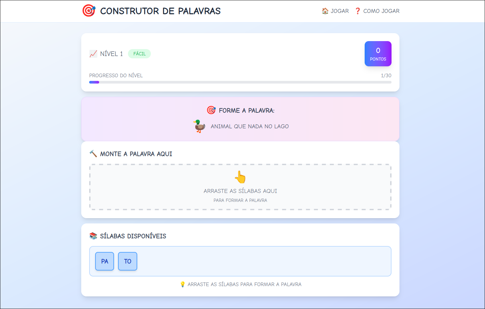

# Word Builder Game 🧩🎮

Word Builder is an interactive educational game designed to help children learn
word formation through syllables. Players drag and drop syllables to construct
words based on visual hints and emoji clues.

## Features

- **Syllable-Based** Learning: Build words by combining syllables
- **Visual Hints**: Emoji and text clues for each word
- **Progressive Difficulty**: 3 difficulty levels (Easy, Medium, Hard)
- **Gamification**:
  - Score system with bonuses
  - Level progression (15 levels total)
  - Visual feedback animations
- **Educational Focus**:
  - Vocabulary building
  - Syllable recognition
  - Spelling practice

## Technologies Used

- **Frontend**:
  - Next.js 14 (App Router)
  - React 18
  - TypeScript
  - Tailwind CSS
- **State Management**: React hooks
- **Animation**: Tailwind CSS animations
- **Linting**: ESLint + Prettie

## License

This project is licensed under the MIT License.
